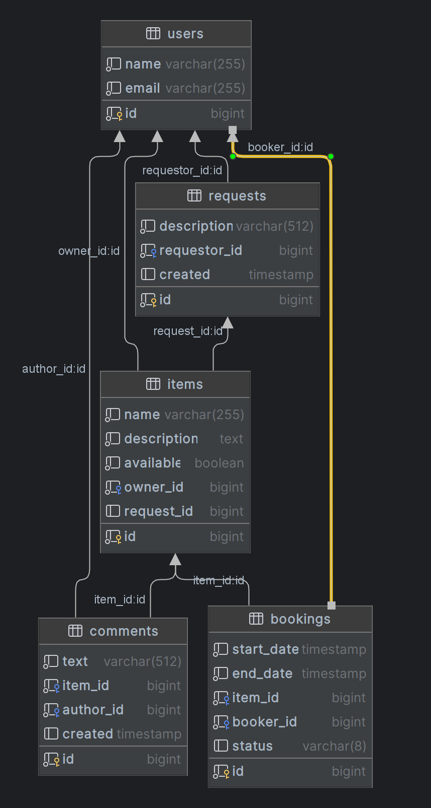

# Java-Shareit

## Назначение

Cервис для шеринга (от англ. share — «делиться») вещей. Шеринг как экономика совместного использования набирает сейчас
всё большую полярность.

## Поддерживаемые REST сервисы

### Booking (Функция бронирования)

**POST /bookings**
Добавление нового бронирования

**PATCH /bookings/{bookingId}?approved={approved}**
Одобрение или отклонение бронирования

**GET /bookings/{bookingId}**
Получение конкретного бронирования

**GET /bookings?state={state}&from={from}&size={size}**
Получение списка бронирований пользователя

**GET /bookings/owner?state={state}&from={from}&size={size}**
Получение списка бронирований вещей пользователя

### Item (Функция вещи)

**POST /items**
Добавление новой вещи

**PATCH /items/{id}**
Изменение вещи

**GET /items/{id}**
Получение конкретной вещи

**GET /items?from={from}&size={size}**
Получение списка вещей пользователя

**GET /items/search?text={text}&from={from}&size={size}**
Поиск вещи по имени и описанию

**DELETE /items/{id}**
Удаление вещи

**POST /items/{itemId}/comment**
Создание отзыва на вещь

### Request (Функция запроса вещи)

**POST /requests**
Добавление запроса на вещь

**GET /requests**
Получение существующего запроса на добавление вещи

**GET /requests/all?from={from}&size={size}**
Получение списка запросов, созданных другими пользователями

**GET /requests/{requestId}**
Получение конкретного запроса

### User (Функция пользователя)

**POST /users**
Добавление пользователя

**PATCH /users/{id}**
Изменение пользователя

**GET /users/{id}**
Получение конкретного пользователя

**GET /users**
Получение списка всех пользователей

**DELETE /users/{id}**
Удаление пользователя

## Развёртывание в Docker

- Выполнить [docker-compose.yml](docker-compose.yml)
-

## Развёртывание в без Docker

Выполнить

- [schema.sql](server%2Fsrc%2Fmain%2Fresources%2Fschema.sql)
- [ShareItGateway.java](gateway%2Fsrc%2Fmain%2Fjava%2Fru%2Fpracticum%2Fshareit%2FShareItGateway.java)
- [ShareItServer.java](server%2Fsrc%2Fmain%2Fjava%2Fru%2Fpracticum%2Fshareit%2FShareItServer.java)

## Использованные технологии

- Java 11
- Spring Boot
- Spring Data JPA
- Hibernate ORM
- REST API
- Docker
- Lombok
- PostgreSQL
- H2
- Maven
- Микросервисная архитектура

## Схема базы данных

